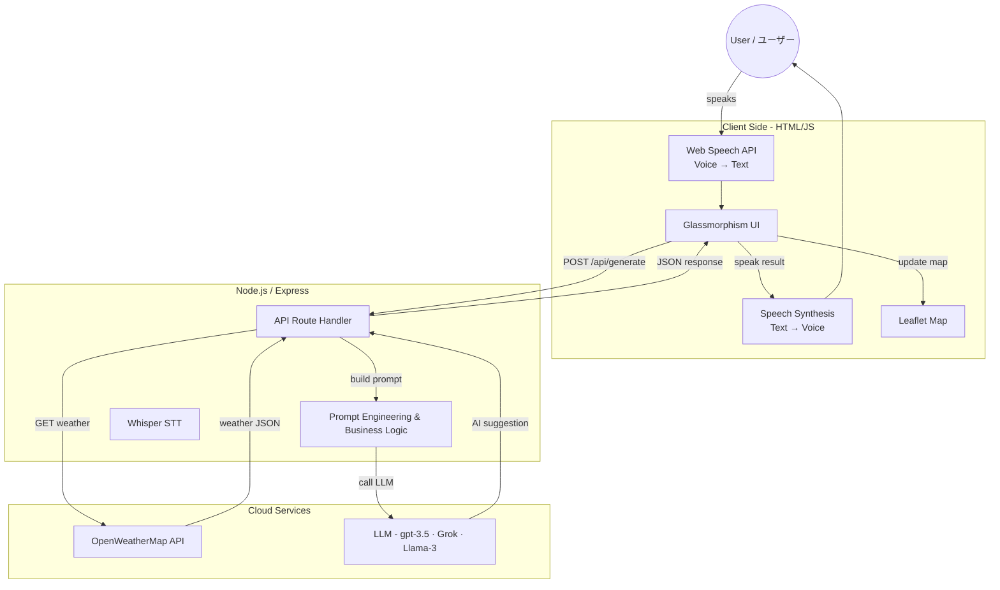

<div align="center">

# 🍃 KazeNoTayori | 風の便り  
### **AI-Powered Weather Outing & Fashion Advisor (AI 天気・ファッションアドバイザー)**  
#### **"Bringing the wisdom of the wind to your daily choices."**  
#### **「風が運ぶ情報で、あなたの日常を彩る。」**

---

## 🚩 Badges  
### （バッジ）


</div>

---

## 📖 Overview  
### （概要）

**KazeNoTayori** (*“News from the Wind”*) is a **bilingual Japanese–English AI-powered weather concierge**.  
**KazeNoTayori（風の便り）** は、**日英バイリンガル対応のAI天気コンシェルジュ**です。

It combines:  
以下の要素を組み合わせています：

- 🔹 **Real-time weather**  
　リアルタイムの天気情報  
- 🔹 **Generative AI reasoning**  
　生成AIによる推論  
- 🔹 **Voice input + TTS**  
　音声入力 + 音声読み上げ  
- 🔹 **Dynamic maps**  
　動的な地図表示  
- 🔹 **Mood-based suggestions**  
　気分に基づくアドバイス提案  

…to create a **personalized, polite Japanese-style assistant**.  
…これにより、**丁寧でパーソナライズされた日本式アシスタント体験**を提供します。

Unlike normal weather apps, it behaves like a **Concierge**:  
一般的な天気アプリとは異なり、**コンシェルジュのように振る舞います：**

> “Based on today's weather in Kyoto and your mood, I recommend…”  
> 「今日の京都の天気とあなたの気分に基づいて、おすすめはこちらです…」

---

## ✨ Key Features  
### （主な機能）

| Feature | Description |
|--------|-------------|
| 🎙️ **Voice-First Interface** | Japanese + English STT (Web Speech API) <br> 日本語 + 英語音声認識 |
| 🧠 **Generative AI Reasoning** | Llama-3-70B (Groq) / GPT-4o <br> 高速生成AI推論 |
| 🌤️ **Live Weather** | OpenWeatherMap Integration <br> 天気データ連携 |
| 🗺️ **Visual Map** | Leaflet + OpenStreetMap <br> 動的地図表示 |
| 📍 **Geolocation** | Auto-detect user's city <br> 現在地自動検出 |
| 🎨 **Glassmorphism UI** | Clean, modern design <br> モダンで透明感のあるUI |
| 🔊 **Text-to-Speech** | Natural spoken output <br> 自然な音声読み上げ |

---

## 🏗️ Architecture  
### （アーキテクチャ）



---

## 🛠️ Tech Stack  
### （技術スタック）

- **Frontend:** HTML5, CSS3 (CSS Variables, Flexbox, Glassmorphism), Vanilla JavaScript (ES6+)  
　フロントエンド：HTML5、CSS3、バニラJavaScript  
- **Backend:** Node.js, Express.js  
　バックエンド：Node.js、Express.js  
- **AI Model:** Llama-3-70b-Versatile (Hosted by Groq) or OpenAI GPT-4o  
　AIモデル：Llama-3-70B または GPT-4o  
- **Weather Data:** OpenWeatherMap API  
　天気API：OpenWeatherMap  
- **Mapping:** Leaflet.js (OpenStreetMap)  
　地図：Leaflet.js  
- **Deployment:** Vercel (Frontend) + Render (Backend)  
　デプロイ：Vercel（フロント）+ Render（バックエンド）

---

## 🚀 Local Installation & Setup  
### （ローカルインストールとセットアップ）

Follow these steps to run the project locally.  
以下の手順でローカル環境で実行できます。

### **1. Clone the Repository**  
#### （リポジトリをクローン）

```bash
git clone https://github.com/yourusername/kazenotayori.git
cd kazenotayori
```

---

### **2. Backend Setup**  
#### （バックエンドセットアップ）

Navigate to the backend folder and install dependencies:  
バックエンドフォルダに移動して依存関係をインストールします：

```bash
cd backend
npm install
```

Create a `.env` file in the backend folder with your API keys:  
`.env` ファイルを作成し、APIキーを入力します：

```
PORT=3000
# Get free key from console.groq.com
OPENAI_API_KEY=gsk_your_groq_api_key_here
# Get free key from openweathermap.org
WEATHER_API_KEY=your_openweather_api_key_here
```

Start the server:  
サーバーを起動します：

```bash
node server.js
```

Expected output: **Server running on port 3000**  
期待される出力：**Server running on port 3000**

---

### **3. Frontend Setup**  
#### （フロントエンドセットアップ）

Open a new terminal, navigate to the frontend folder, and serve it:  
新しいターミナルでフロントエンドフォルダに移動し、サーバーを起動します：

```bash
cd frontend
python -m http.server 5500
```

Open your browser at:  
以下のURLをブラウザで開きます：

👉 **http://127.0.0.1:5500**

---

## 🧪 How to Use  
### （使い方）

- **Select Language:** Toggle between English and Japanese using the top-right button.  
　言語切替：右上のボタンで英語/日本語を切り替え  
- **Input Location:**  
　位置入力方法：
  - Click the Pin Icon (📍) to use your current GPS location  
　　　📍 ピンアイコンを押して現在地を使用  
  - OR Click the Mic Icon (🎙️) and say a city name  
　　　🎙️ マイクで都市名を話す  
  - OR Type manually  
　　　入力欄に直接質問を記入  
- **Get Advice:** Click **Send Plan** — the AI generates a custom plan.  
　アドバイス生成：**Send Plan** をクリック  
- **Listen:** Click **Play (🔊)**  
　音声再生：**🔊 Play** をクリック  
- **View Map:** Scroll down to see the map.  
　地図表示：下へスクロール

---

## 🔮 Future Roadmap  
### （今後の展望）

- 👗 **Visual Outfit Generation:** Stable Diffusion for outfit images  
　服装画像生成機能（Stable Diffusion 連携）  
- 📅 **Calendar Sync:** Use free time from Google Calendar  
　Googleカレンダーの空き時間と連携  
- 🚄 **Route Planning:** Google Maps API for travel routes  
　Google Maps API による経路案内  

---

Thank you for reviewing this project. I enjoyed building this bridge between technology and daily life.  
本プロジェクトをご覧いただきありがとうございます。技術と日常をつなぐこのアプリケーションの開発を楽しみました。

